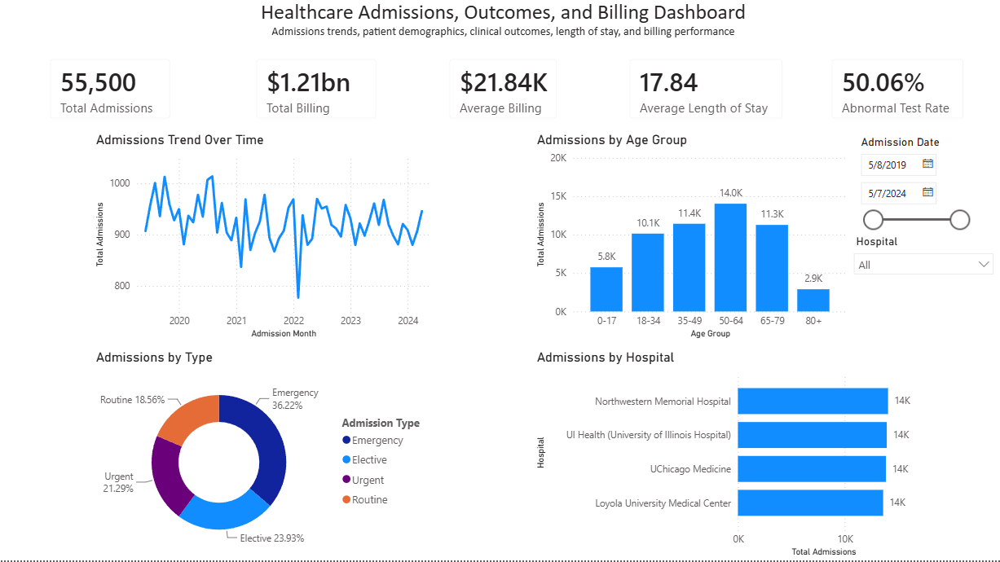
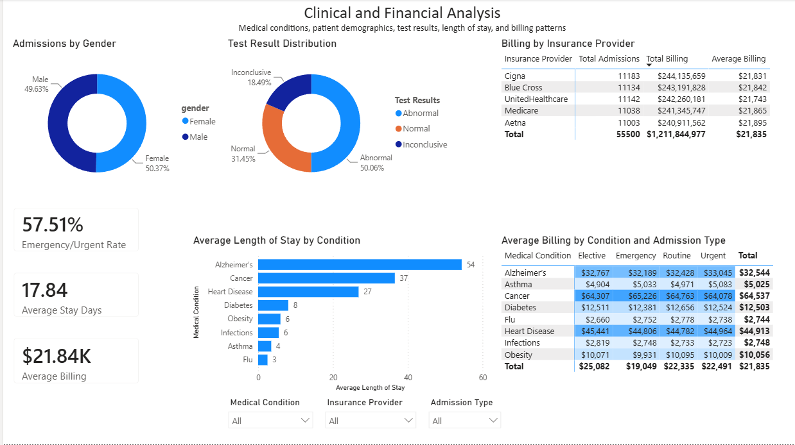

# Healthcare Admissions Analysis (SQL + Power BI)

Which conditions drive the longest stays and the highest billing, and are they the same ones? This project analyzes a synthetic healthcare dataset of 55,500 admission records across eight medical conditions, using SQL for cleaning and analysis and Power BI for the dashboard.

> Demonstration project built on a synthetic dataset. Figures describe patterns within the data and are not real-world clinical findings. Relationships shown are descriptive associations, not causal claims.

## A few findings

- Length of stay was validated against the admission-to-discharge date calculation across all 55,500 rows, with zero mismatches.
- The highest-billing condition (Cancer, about $64.5K on average) is not the longest-staying one (Alzheimer's, about 54 days on average), so billing and length of stay rank conditions differently.
- Average billing rises with age band across the dataset.

## Tools

SQL (SQLite via DB Browser) for cleaning, transformation, and analysis. Power BI for the data model, DAX measures, and the dashboard.

## Contents

- `healthcare_analysis.sql` — cleaning, transformation, and analysis queries
- `dashboard-overview.png`, `dashboard-clinical.png` — dashboard screenshots

The Power BI file and the dataset aren't committed here to keep the repo lean; the SQL and the screenshots reproduce the analysis.

## Author

Eric Benitez
